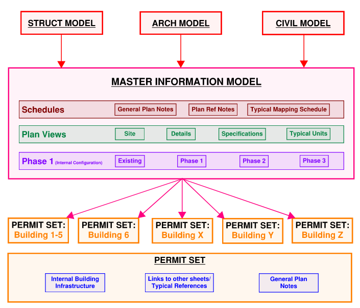

# Campus Multifamily Projects

The following is a summary of the proposed Revit best practices for PermitZIP multifamily projects that include multiple buildings and phases.

## 🏁 Planning

- Build the `🗽 BIM360 Model Structure` in `BIM 360` / **BIM Manager**
- Identify typicals / **Design Lead**
  - Coordinate with architect if possible.
  - Do this on a SINGLE shared pdf in a bluebeam session
- Create the Sheet List in `Host.rvt` / **Design Lead**

## 🏗 Revit Model Structure

_image by: [Vivek Ramdas](https://www.linkedin.com/in/vivek-ramdas-p-80265b14b/) Plumbing & Mechanical_

### 👵 Master Information - MEP.rvt

#### 🦑 Schedules

One way to hack the problems with plan notes through linkd modeles is to use
model elements instead of annotative families. Choose a category from a
discipline which is not include in scope and use it to populate plan note schedules.

- General Plan Notes
- Plan Reference notes
- Typical Mapping Schedule

#### 🪐 Plan Views

- Site
- Details
- Specifications
- Typical Units
- Phases (internal configuration)

### 🏛️ Building n - MEP.rvt

A total of n models, one for or each permit set.

- internal building infrastructure
- links to other sheets / typical reference
- general plan notes
